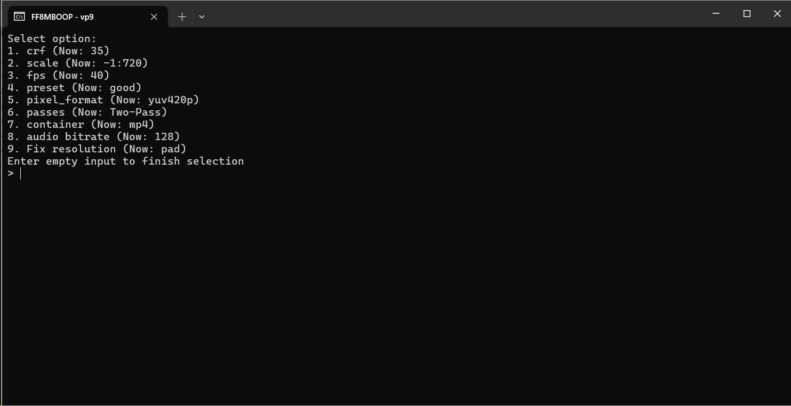

# FF8MBOOP
Обёртка FFmpeg с установкой параметров через консольное меню.
## История проекта и что это вообще такое

Я играю в игры и часто сохраняю забавные моменты, чтобы показать друзьям в дискорде. Ограничение дискорда в 8MB на файл привело к тому, что родился скрипт FF8MB.py. То есть скрипт, который с помощью FFmpeg конвертирует файл в 8MB.
Скрипт этот представлял собой процедурную "спагетину", которую надо было редактировать под каждый файл, рассчитывая нужный битрейт руками.

Со временем мои знания Python и FFmpeg улучшались и новая итерация FF8MB уже использовала не постоянный битрейт (CBR), а Constant Rate Factor. Ограничение в 8MB перестало быть актуальным. Та версия всё ещё была монолитной "спагетиной" почти без определения своих функций.

Оно отлично работало, но мне не было покоя. Поддерживать и расширять такое очень трудно. Под новый кодек нужно было копировать скрипт и переписывать специфичные для кодека места. Мне хотелось реализовать что-то более универсальное и расширяемое.

Архитектуру OOP-реализации я периодически обдумывал в течение многих лет. Опыта OOP почти не было, так что было непросто. Так я начинал и забивал раз 5, пока не обсудил оптимальную архитектуру с нейронкой. 
После перебора весьма непродуктивных предложений, удалось таки понять какой вариант реализации был бы наиболее логичным и удобным для меня. Его вы видите тут.

## Суть реализации

Сердцем данной реализации является **my_codecs.py**. Здесь реализован базовый класс Codec и его экземпляры. Каждый экземпляр это "модель" кодека, которая описывает какие параметры можно настраивать и какие значения параметры принимают. Таким образом, можно легко добавить новый кодек, просто скопировав и отредактировав экземпляр другого кодека.

**menu.py** Составляет меню на базе списка (вообще-то словаря) параметров кодека, так что, фактически, меню актуализируется самостоятельно под новый кодек.
Есть три типа параметров и соответствующие им реализации подменю:
- со свободным вводом: 
В экземпляре кодека данному параметру не задаются никакие варианты и ограничения. Вместо этого задаётся None. В таком случае, меню просто принимает любой ввод.
- с выбором из вариантов:
В экземпляре кодека данному параметру задаются варианты значения в виде списка. Тогда меню предлагает вам выбрать из возможных вариантов.
- **уникальный параметр** или **параметр с собственной обработкой**:
Что там указано в экземпляре кодека не играет роли. Мы реализуем уникальную логику для данного параметра самостоятельно, "перехватывая" универсальный метод handle_param(). Пример такого параметра является scale и его реализация через handle_scale(). Обратите внимание на механизм перехвата:

    ```
    if param == "scale":
        self.handle_scale() 
    ```

    Так можно реализовать индивидуальную обработку любого параметра. 
    
    **ВАЖНО**: Эти параметры в экземпляре Codec могут выглядеть как первые два. Их "уникальность" задаётся внутри класса menu.py -> Menu

**commander.py** Данный модуль принимает настройки, заданные через меню и составляет итоговую команду FFmpeg согласно этим настройкам. При добавлении новых параметров в Codec, нужно также расширить генерацию команды в commander.py — это точка, где логика связывается с FFmpeg.

**runner.py** Универсальный раннер, который спрашивает какой из поддерживаемых кодеков вы хотите использовать, выводит соответсвующее меню, генерирует команду FFmpeg и прогоняет её для всех файлов.

**runner_%codec_name%** Раннер, который пропускает выбор кодека.

**defaults.json** Стандартные настройки параметров кодека, которые применяются при запуске. Если этот файл удалить, то он будет создан заново. Тут можно поменять стандартные значения для своих типичных сценариев.

## Зависимости
- Python. Достаточно новый, чтобы поддерживать f-строки. 
- FFmpeg добавленный в path

## Как использовать?

Перетащите видеофайлы на runner по вкусу, установите настройки (если надо), нажмите enter и ждите пока FFmpeg сделает своё дело. Готовые файлы будут лежать в папке Output в папке проекта.
Вероятно, ваша ОС не разрешает Drag & Drop файлов на файлы Python. Что ж, вот что с этим делать:
- ничего, потому что это просто тренировочный проект, реализующий не самый широкий сценарий взаимодействия с FFmpeg и никто не будет пользоваться им, когда есть куча GUI.
- погуглить как включить Drag & Drop файлов на файлы Python.
- добавить скрипт в виде кнопки в вашем файловом менеджере а-ля Total Commander. 

## Как добавить поддержку кодека?

В модуле my_codecs.py добавить новый экземпляр Codec, по аналогии с теми кодеками что уже там есть. Просто посмотрите как оно выглядит и всё поймёте.
Так же можно добавить стандартные значения вашего кодека в defaults.json, а если совсем захотеть в helpers.create_defaults_json_if_missing()
При желании можно сделать runner для вашего кодека по аналогии с уже существующими.

## TO DO or not TO DO
Что я хотел бы сделать лучше или иначе, но скорее всего не буду:

- Добавить возможность задать альтернативный текст подсказки для подменю без переопределения всего метода.
- Может вместо стандартных значений сохранять и использовать настройки предыдущего прогона? (сомнительно)
- Добавить красивый прогресс бар
- Сделать автоматическую сборку в exe через GithubActions?
- Раннер, который пропускает меню и сразу рендерит со стандартными параметрами.
